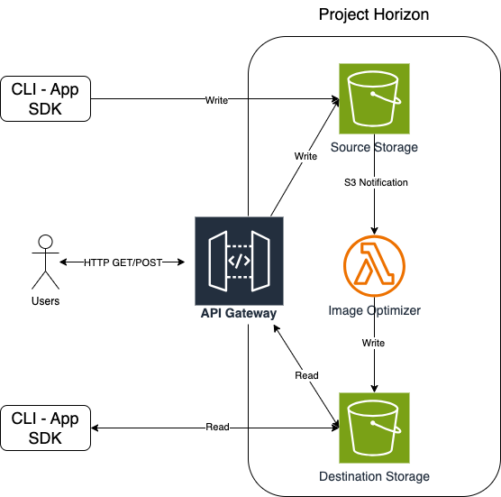

# ProjectHorizon

## Description
Imagine a world where images are processed and transformed effortlessly in the cloud.  
_Project Horizon_ is an image processing pipeline that optimize images uploaded by users, making them smaller and faster to load without sacrificing visual quality.

## System Requirements

### Functional Requirements
- The service is automatically triggered when an image is uploaded to a source storage. (eg an object storage).
- The service processes the image uploaded to the source storage and uploads it to a destination storage.
- The processed image must be lighter and faster to load.
- The system must ensure good quality of the processed images.

### Non-Functional Requirements
- The system ensures efficient image processing to minimize execution time and costs.
- The system includes basic error handling to ensure the robustness of your function.

## System Design

### Infrastructure
As the architecture, I implemented a serverless architecture on AWS as it meets all functional and non-functional requirements.  
- Despite the limited time available, IaC tools allow for the setup of the infrastructure with minimal effort.
- AWS events are easy to leverage to implement an event-driven asynchronous system.
- With the AWS Lambda service, we ensure efficiency and low costs thanks to the pay-per-use pricing model.

The system leverages Lambda and S3 services to operate and can be interacted with through CLIs, applications using the AWS SDK, or clients that interact with the system via HTTP and an API Gateway if the application needs to scale.
 
 
Given the limited time, **the system can only be interacted with through the CLI for now**.

## Balance between speed, storage, and image quality.
The system uses the [SixLabors.ImageSharp](https://docs.sixlabors.com/articles/imagesharp/index.html?tabs=tabid-1) library to manipulate images and is configured to balance storage efficiency and image quality.  
 
The maximum size of the optimized images is 1.000x1.000 pixels, and the Lanczos algorithm is used for downscaling, ensuring good image quality. You can configure it in the `appSettings.json` file by modifying the `MaxImageDimension` property.
  
To prevent memory issues on Lambda, the property `MaxImageSizeInBytes` in the `appSettings.json` file has been configured to set the maximum image size (in bytes) for processing. If a larger image is uploaded to the source storage bucket, it will not be processed by the Lambda.
  
As the conversion algorithm, WebP in Lossless mode has been used. WebP is a good choice because it offers efficient compression without compromising image quality and is supported by all major web browsers.

### Benchmarks (Maximum image dimension: 1000 pixels)
| Filename             | Original Dimension (pixels) | Original Size (MB) | Final Dimension (pixels) | Final Size (MB) | Lambda Billed Duration (ms) |
|----------------------|-----------------------------|--------------------|--------------------------|-----------------|-----------------------------|
| source_800_800.png   | 800x800                     | 1.3                | 800x800                  | 0.77            | 7228                        |
| source_1920_1080.png | 1920x1080                   | 3.9                | 1000x562                 | 0.70            | 7632                        |

## How to deploy and run Project Horizon

For deploying and running Project Horizon, you need to have:

- [An AWS account](https://aws.amazon.com/account/?nc1=h_ls)
- [AWS CLI configured](https://docs.aws.amazon.com/cli/latest/userguide/cli-chap-getting-started.html)
- [SAM (Serverless Application Model)](https://docs.aws.amazon.com/serverless-application-model/latest/developerguide/install-sam-cli.html#install-sam-cli-instructions)

### Build artifacts

- `cd ImageOptimizerLambda/src/ImageOptimizerLambda`
- `sam build`

### Deploy the infrastructure to AWS

- Run `sam deploy --guided` the first time, or `sam deploy` for subsequent deployments.

#### SAM configurations (only the first time)

During the deployment, you will be asked for some parameters:

- Stack Name [sam-app]: `insert a stack name (es. 'project-horizon')`
- AWS Region [us-east-1]: `insert an AWS Region (es. 'us-east-1')`
- Confirm changes before deploy [y/N]: `insert: 'n'`
- Allow SAM CLI IAM role creation [Y/n]: `insert 'y'`
- Disable rollback [y/N]: `insert 'n'`
- Save arguments to configuration file [Y/n]: `insert 'y'`
- SAM configuration file [samconfig.toml]: `insert a file name (es. 'samconfig.toml')`
- SAM configuration environment [default]: `insert a configuration environment (es. 'default')`

### Invoke the image optimizer

- Upload an image on the source S3 bucket.
    - Run `aws s3 cp <local_path>/image_name.png s3://<YOUR_AWS_ACCOUNT_ID>-source-bucket`
- Download the optimized image from the destination S3 bucket.
    - Run `aws s3 cp s3://<YOUR_AWS_ACCOUNT_ID>-destination-bucket/image_name.webp <local_path> `

There are some images provided for you inside the `SourceImages` folder.

### Delete the infrastructure

- Run `aws s3 rm s3://<YOUR_AWS_ACCOUNT_ID>-source-bucket --recursive` to empty the source S3 bucket.
- Run `aws s3 rm s3://<YOUR_AWS_ACCOUNT_ID>-destination-bucket --recursive` to empty the destination S3 bucket.
- Run `sam delete` to delete the infrastructure.

## How to run unit tests

- Run `dotnet test`
